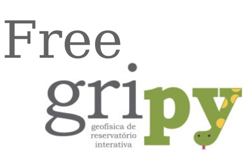

# Free GRIpy

Um fork do projeto [GriPy](https://github.com/giruenf/GRIPy), acrônimo para Geofísica de Reservatório Interativa em Python, desenvolvido e mantido pelo Grupo de Inferência de Reservatório (GIR) da Universidade Estadual do Norte Fluminense [(UENF)](https://uenf.br/portal/).
A inclusão do prefixo 'Free' no nome se deve ao fato deste ser uma versão do projeto original pensada para
ser totalmente livre e gratuita.

  

## Oque é GRIPy?

__GriPy__, acrônimo para Geofísica de Reservatório Interativa em Python, como explicitamente indicado, é um aplicativo escrito em linguagem Python e bibliotecas especialistas, projetado especialmente para a execução de estudos de caracterização e modelagem petrofísica probabilística com integração de dados e informações de rocha-perfil-sísmica.

## Quando o projeto GRIPy iniciou?

O início de seu desenvolvimento ocorreu em 2013, através de um projeto patrocinado pela PETROBRAS com recursos da
cláusula de P&D da Agência Nacional de Petróleo (ANP). O amadurecimento da consolidação da arquitetura do software
foi seguido da proposta aprovada pela PETROBRAS de distribuição livre dos módulos básicos do GriPy na modalidade
de código aberto (open source), com possibilidade de construção de módulos específicos na forma de plugins
com acesso aberto ou restrito.

## Qual o estágio atual do GRIPy?

O software ainda está em estágio precoce de desenvolvimento com poucas funcionalidades para uso prático,
sendo disponibilizado apenas para servir como uma plataforma de desenvolvimento de novas funcionalidades
e fluxos de trabalho. O objetivo é que em breve teremos todas as funcionalidades básicas, incluindo a
manipulação de arquivos (leitura e escrita), visualização (plotagem de perfis, crossplots, etc), edição de perfis,
cálculo convencional de propriedades petrofísicas, modelagem sísmica em poços e análises de
dados petrofísicos em testemunhos.

## Quem está desenvolvendo o projeto?

O desenvolvimento do software é conduzido por pesquisadores do Grupo de Inferência de Reservatório (GIR)
na Universidade Estadual do Norte Fluminense (UENF).

## Requisitos (para Windows ou Linux)
* Python 3.6 (ou maior)
* NumPy 1.17.2 (ou maior)
* Matplotlib 3.1.1 (ou maior)
* SciPy 1.2.1 (não pode ser maior)
* scikit-learn 0.21.3 (ou maior)
* PyMC 3.6 (ou maior) 
* wxPython 4.0.0 (ou maior)

Uma boa ferramenta para a utilização do software, embora não seja a única, é o [Anaconda](https://www.continuum.io/downloads), pois conta com todas as bibliotecas necessárias (exceto o versão wxPython), assim como com um ambiente de desenvolvimento completo.

